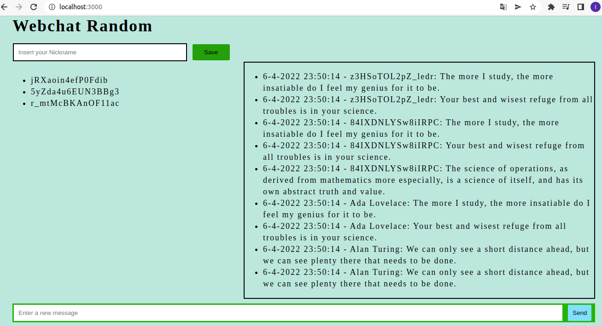

# Boas vindas ao repositório do projeto WebChat!

O projeto consiste em um chat online, onde poderá existir um número indeterminado de pessoas. A implementação do código foi feita baseada na arquitetura de software MVC (Model-View-Controller).

# Layout do Chat

# Tecnologias Usadas

- HTML
- CSS
- JavaScript
- Node.js
- Socket.io
- Express
- MongoDB
- EJS

# Rodando o Projeto Localmente

1° `https://github.com/lucasam1992/project-webchat.git` - Clone o repositório para sua máquina  
2° `cd project-webchat` - Entre na pasta do repositório clonado  
3° `npm install` - Instale as dependências  
4° `npm run dev` - Execute o servidor  
5° `http://localhost:3000` - Acesse o chat  

### Conexão com o Banco
 Para que o projeto rode em sua máquina, você deve criar as seguintes variáveis de ambiente:  
  `DB_URL=mongodb://localhost:27017/webchat/` - conexão local  
  `DB_NAME=webchat` - nome do banco de dados  

# Autor

- Lucas Machado
